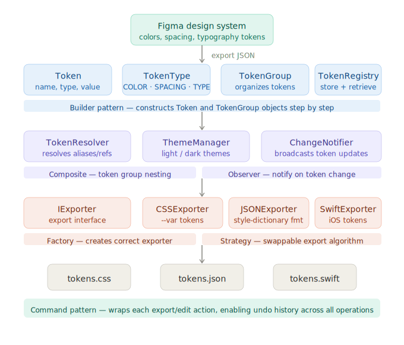

# Design Token Engine

A Java-based CLI tool for managing, transforming, and exporting design tokens
across formats (JSON, CSS, Swift). Built for SE-350 Object Oriented Software
Development at DePaul University.

This project is part of a larger end-to-end design system pipeline connecting
Figma (design), Java (token processing), and React (component library).

---

## What is a Design Token?

A design token is a named variable that stores a visual design decision — like
a color, a spacing value, or a font size. Instead of hardcoding `#0055FF` in
every component, a team defines a token called `color.primary = #0055FF`.
Every component references the token. When the color changes, every component
updates automatically.

Design tokens are the foundation of scalable design systems used by companies
like Google (Material Design), Salesforce (Lightning), and IBM (Carbon).

---

## The Full Pipeline

This project sits at the center of a three-layer design system pipeline:
A designer changes a color in Figma → exports JSON → the Java engine processes
and validates it → outputs CSS custom properties → every React component updates
automatically. No manual find-and-replace across a codebase.

---

## Why This Matters for UX Engineering

UX Engineers bridge design and engineering. Design token tooling is a core part
of that role at companies building large-scale design systems. Tools like
Amazon Style Dictionary, Figma Tokens, and Theo solve this problem in
JavaScript. This project explores the same problem space using Java OOP
principles and design patterns.

---

## Architecture



---

## Design Patterns Used

| Pattern | Where | Why |
|---|---|---|
| Builder | Token and TokenGroup construction | Step-by-step object creation |
| Factory | Exporter creation | Pick the right exporter at runtime |
| Strategy | Export algorithms | Swap CSS / JSON / Swift without changing core logic |
| Composite | TokenGroup containing Tokens | Nest groups of tokens naturally |
| Observer | ChangeNotifier | Broadcast token changes to dependents |
| Command | Export and edit actions | Enable undo history across operations |

---

## Project Structure

````
design-token-engine/
  src/
    main/
      Main.java
    token/
      Token.java
      TokenType.java
      TokenGroup.java
      TokenRegistry.java
  lib/
  docs/
    architecture.svg
  README.md
```

- **In a group?** No — solo project
- **Programming language:** Java 17 (OpenJDK Temurin 17.0.16)
- **GitHub repository:** https://github.com/gneliana/design-token-engine
- **Entry point:** `src/main/Main.java`
- **Hello World compiles and runs?** Yes

---

## Sprint 2 Goal

Build the core token model — Token, TokenType, TokenGroup, and TokenRegistry —
so that tokens can be defined, organized into groups, stored, and retrieved.
Demonstrate working token creation and display in Main.

---

## Future Sprints

- Sprint 3: Builder pattern + TokenResolver (alias resolution)
- Sprint 4: Export layer (CSS, JSON, Swift) using Factory + Strategy patterns
- Sprint 5: Observer + Command patterns, undo history, theme switching

---

## End Goal

A working CLI demo that ingests a Figma token JSON file, resolves all token
aliases, and exports a valid tokens.css file — which will power a React
portfolio website with a live light/dark theme switcher.

---

## Bugs / Notes

None yet.

---

## AI Assistance Disclosure

This project was developed with significant assistance from Claude (Anthropic),
used as an AI pair-programming and mentorship tool throughout the course.

Claude's involvement included:
- Helping design the overall project architecture and pipeline vision
- Explaining how design tokens connect to real-world UX engineering workflows
- Suggesting which OOP design patterns fit each layer of the engine and why
- Writing and explaining each Java class step by step
- Generating the architecture SVG diagram in the README
- Helping structure and write this README

All code was reviewed, compiled, and committed by Eliana Betancur. Every design
decision was discussed and understood before implementation. The project concept
— connecting a Java token engine to a Figma design system and React portfolio
site — came from Eliana's own career goals and prior professional experience
working on design systems.

Per the SE-350 syllabus, AI tools are listed under Required Technology and are
permitted for use in this course.
